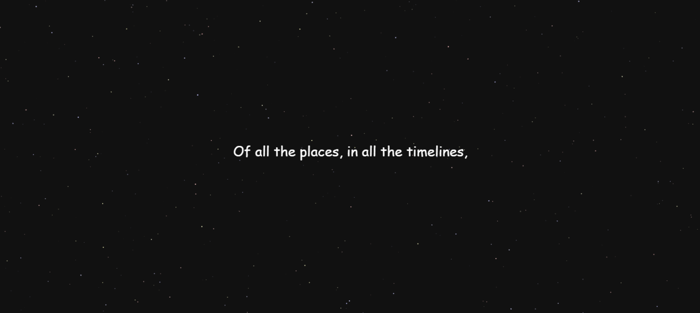

# Heartstruct Night 🌌  

Heartstruct Night is a mesmerizing animated experience that expresses deep love through a glowing text journey set against a cosmic backdrop. It creates an emotional atmosphere, blending love and the vast beauty of the universe.  

## Features  
- **Animated Love Message:** Gradual fade-in and fade-out text to build anticipation and emotion.  
- **Cosmic Aesthetic:** A deep, starry night theme symbolizing endless love.  
- **Custom Love-Themed Cursor:** A special touch to make navigation feel magical.  
- **Personalized Final Line:** Ends with *"In this universe, you have my heart!"*  
- **Smooth Transitions:** Seamless text flow for an immersive experience.  

## Preview  
A glimpse of **Heartstruct Night** in action:  

  

## 💡 How It Works  
1. **Text Animation:** The text gradually appears and fades, creating a smooth emotional progression.  
2. **Custom Cursor:** A themed cursor enhances the experience.  
3. **Cosmic Background:** A deep night sky represents the endless universe of love.  
4. **Final Message:** Ends with a heartfelt declaration of love.  

## Customization  
- Change the **messages** in `drawText()` to make it more personal.  
- Modify **colors** in `style.css` to match your aesthetic.  
- Replace the **cursor image** in `images/` with another custom pointer.  

## Contribution  
Want to enhance **Heartstruct Night**?  
- Fork the repository.  
- Create a new branch.  
- Make your changes and submit a pull request.  

## A Special Note  
This project was crafted with love, care, and a touch of magic. Whether you're sharing it with someone special or simply enjoying its beauty, may it remind you of the infinite possibilities of love.  

---
***PS: You are my Universe!🌌💖***
